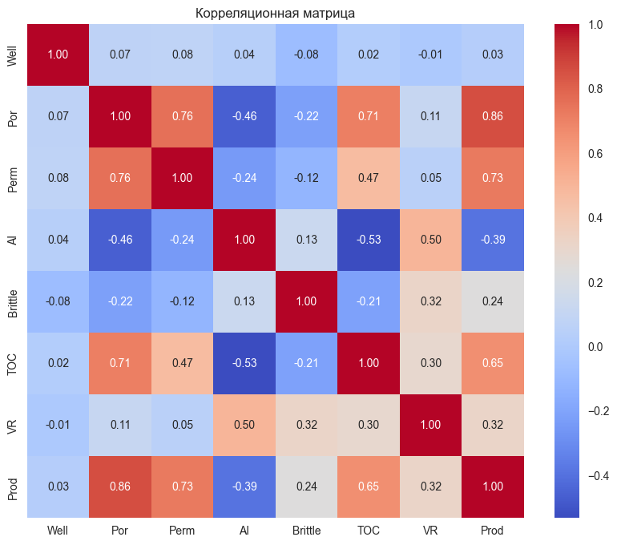
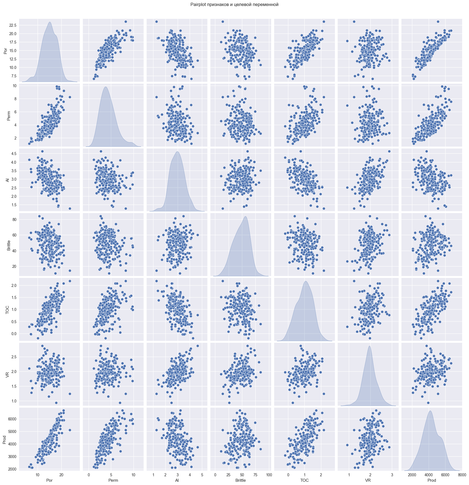
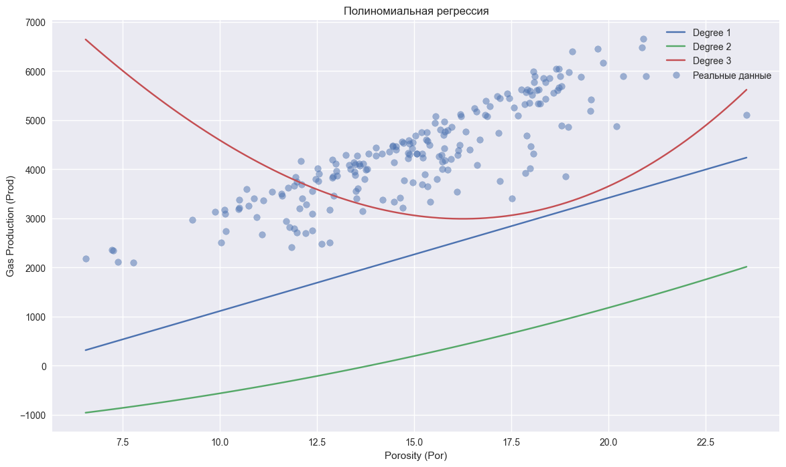

```python
# =============================================
# ПРАКТИЧЕСКАЯ РАБОТА №10
# Полиномиальная регрессия + Регуляризация (Ridge, Lasso)
# Датасет: Gas Well Production
# =============================================

import pandas as pd
import numpy as np
import matplotlib.pyplot as plt
import seaborn as sns
from sklearn.model_selection import train_test_split
from sklearn.preprocessing import PolynomialFeatures, StandardScaler
from sklearn.linear_model import LinearRegression, Ridge, Lasso
from sklearn.metrics import r2_score, mean_squared_error
from sklearn.pipeline import Pipeline

plt.style.use('seaborn-v0_8')

# ====================== 1. ЗАГРУЗКА ДАННЫХ ======================
url = "https://aegis4048.github.io/downloads/notebooks/sample_data/unconv_MV_v5.csv"
df = pd.read_csv(url)

print("Размер датасета:", df.shape)
print(df.columns.tolist())
display(df.head())
```

    Размер датасета: (200, 8)
    ['Well', 'Por', 'Perm', 'AI', 'Brittle', 'TOC', 'VR', 'Prod']
    


<div>
<style scoped>
    .dataframe tbody tr th:only-of-type {
        vertical-align: middle;
    }

    .dataframe tbody tr th {
        vertical-align: top;
    }

    .dataframe thead th {
        text-align: right;
    }
</style>
<table border="1" class="dataframe">
  <thead>
    <tr style="text-align: right;">
      <th></th>
      <th>Well</th>
      <th>Por</th>
      <th>Perm</th>
      <th>AI</th>
      <th>Brittle</th>
      <th>TOC</th>
      <th>VR</th>
      <th>Prod</th>
    </tr>
  </thead>
  <tbody>
    <tr>
      <th>0</th>
      <td>1</td>
      <td>12.08</td>
      <td>2.92</td>
      <td>2.80</td>
      <td>81.40</td>
      <td>1.16</td>
      <td>2.31</td>
      <td>4165.196191</td>
    </tr>
    <tr>
      <th>1</th>
      <td>2</td>
      <td>12.38</td>
      <td>3.53</td>
      <td>3.22</td>
      <td>46.17</td>
      <td>0.89</td>
      <td>1.88</td>
      <td>3561.146205</td>
    </tr>
    <tr>
      <th>2</th>
      <td>3</td>
      <td>14.02</td>
      <td>2.59</td>
      <td>4.01</td>
      <td>72.80</td>
      <td>0.89</td>
      <td>2.72</td>
      <td>4284.348574</td>
    </tr>
    <tr>
      <th>3</th>
      <td>4</td>
      <td>17.67</td>
      <td>6.75</td>
      <td>2.63</td>
      <td>39.81</td>
      <td>1.08</td>
      <td>1.88</td>
      <td>5098.680869</td>
    </tr>
    <tr>
      <th>4</th>
      <td>5</td>
      <td>17.52</td>
      <td>4.57</td>
      <td>3.18</td>
      <td>10.94</td>
      <td>1.51</td>
      <td>1.90</td>
      <td>3406.132832</td>
    </tr>
  </tbody>
</table>
</div>


```python
# ====================== 2. EDA ======================
plt.figure(figsize=(10, 8))
sns.heatmap(df.corr(), annot=True, cmap='coolwarm', fmt='.2f')
plt.title('Корреляционная матрица')
plt.show()

# Выбираем признаки
features = ['Por', 'Perm', 'AI', 'Brittle', 'TOC', 'VR']
X = df[features]
y = df['Prod']

sns.pairplot(df[features + ['Prod']], diag_kind='kde')
plt.suptitle('Pairplot признаков и целевой переменной', y=1.02)
plt.show()
```


    

    


    

    


```python
# ====================== 3. Подготовка данных ======================
X_train, X_test, y_train, y_test = train_test_split(X, y, test_size=0.2, random_state=42)

scaler = StandardScaler()
X_train_scaled = scaler.fit_transform(X_train)
X_test_scaled = scaler.transform(X_test)
```


```python
# ====================== 4. Полиномиальная регрессия ======================
degrees = [1, 2, 3, 4]
results = []

plt.figure(figsize=(14, 8))

for degree in degrees:
    poly = PolynomialFeatures(degree=degree)
    X_train_poly = poly.fit_transform(X_train_scaled)
    X_test_poly = poly.transform(X_test_scaled)
    
    # Обычная линейная регрессия на полиномиальных признаках
    model = LinearRegression()
    model.fit(X_train_poly, y_train)
    y_pred = model.predict(X_test_poly)
    
    r2 = r2_score(y_test, y_pred)
    rmse = np.sqrt(mean_squared_error(y_test, y_pred))
    results.append((degree, r2, rmse))
    
    print(f"Degree {degree}: R² = {r2:.4f}, RMSE = {rmse:.2f}")

# Визуализация (для одного признака — Por)
X_plot = np.linspace(X['Por'].min(), X['Por'].max(), 100).reshape(-1, 1)
X_plot_full = np.zeros((100, X_train.shape[1]))
X_plot_full[:, 0] = X_plot.ravel()  # Por как главный признак

for degree in [1, 2, 3]:
    poly = PolynomialFeatures(degree=degree)
    X_plot_poly = poly.fit_transform(scaler.transform(X_plot_full))
    model = LinearRegression().fit(poly.fit_transform(X_train_scaled), y_train)
    y_plot = model.predict(X_plot_poly)
    plt.plot(X_plot, y_plot, label=f'Degree {degree}')

plt.scatter(df['Por'], df['Prod'], alpha=0.5, label='Реальные данные')
plt.xlabel('Porosity (Por)')
plt.ylabel('Gas Production (Prod)')
plt.title('Полиномиальная регрессия')
plt.legend()
plt.show()
```

    Degree 1: R² = 0.9506, RMSE = 204.46
    Degree 2: R² = 0.9731, RMSE = 150.78
    Degree 3: R² = 0.9888, RMSE = 97.49
    Degree 4: R² = 0.9875, RMSE = 102.89
    

    c:\Users\user\AppData\Local\Programs\Python\Python313\Lib\site-packages\sklearn\utils\validation.py:2739: UserWarning: X does not have valid feature names, but StandardScaler was fitted with feature names
      warnings.warn(
    c:\Users\user\AppData\Local\Programs\Python\Python313\Lib\site-packages\sklearn\utils\validation.py:2739: UserWarning: X does not have valid feature names, but StandardScaler was fitted with feature names
      warnings.warn(
    c:\Users\user\AppData\Local\Programs\Python\Python313\Lib\site-packages\sklearn\utils\validation.py:2739: UserWarning: X does not have valid feature names, but StandardScaler was fitted with feature names
      warnings.warn(
    


    

    


```python
# ====================== 5. Регуляризация (Ridge + Lasso) ======================
poly = PolynomialFeatures(degree=3)
X_train_poly = poly.fit_transform(X_train_scaled)
X_test_poly = poly.transform(X_test_scaled)

ridge = Ridge(alpha=1.0)
lasso = Lasso(alpha=0.1, max_iter=10000)

ridge.fit(X_train_poly, y_train)
lasso.fit(X_train_poly, y_train)

print("Ridge R²:", r2_score(y_test, ridge.predict(X_test_poly)))
print("Lasso R²:", r2_score(y_test, lasso.predict(X_test_poly)))
```

    Ridge R²: 0.9918917977930567
    Lasso R²: 0.9917931759769919
    
